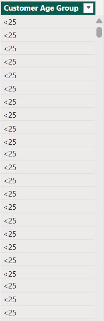

# AI Banking-Dashboard

### Dashboard Link : https://app.powerbi.com/reportEmbed?reportId=c2639dd1-0465-4168-bc22-f1bfa30a7752&autoAuth=true&ctid=4190cc35-fd93-4aa6-9817-c1121132f7e2

## Problem Statement

This dashboard provides a detailed analysis of banking operations using a synthetic dataset of ~10,000 records. It helps the bank track transactions, account balances, inactive accounts, and customer demographics. By monitoring these metrics, the bank can identify problem areas, manage risks, and improve customer engagement.

Key observations from the dashboard include:

Transaction Trends:
Around 2,000 transactions are recorded, split almost equally between Debit (49%) and Credit (51%).
Monthly transaction amounts peak at 5.1M in May and drop as low as 0.8M in July and October, showing significant seasonal variation.

Balances:
Current accounts show a combined balance of -4.1M, while Savings accounts remain at 0M.
At a customer level, balances are highly skewed, with Priya Singh at -15.78M (negative outlier) and Mark Lee at 5K (positive).

Inactive Accounts:
The number of inactive accounts has grown over time, reaching 2 inactive accounts by the end of 2024.

Customer Demographics:
The largest customer segment is ages 36–50 (200 customers), followed by ages 26–35 (100 customers).
Gender distribution highlights missing data: 25% Male, 25% Female, and 50% unspecified.


## Steps Followed  

- **Step 1:** Created a synthetic dataset in **SQL Server Management Studio (SSMS)**. Three tables were generated – **Customers**, **Accounts**, and **Transactions** – using SQL scripts. ~10,000 transaction records were inserted for analysis.  

- **Step 2:** Identified intentional **data quality issues** (nulls, inconsistent date formats, lowercase currency codes).  
  Standardized date format to **MM-DD-YYYY** using SQL update statements.  

- **Step 3:** Combined the three tables into a single consolidated table **CombinedBankingDataset** using `LEFT JOINs`.  
  This preserved all transaction data but introduced some nulls for unmatched rows.  

- **Step 4:** Imported the consolidated dataset into **Power BI Desktop** and verified ~10,000 rows were loaded.  

- **Step 5:** Opened **Power Query Editor** and enabled full column profiling (based on entire dataset).  
  Cleaning steps included:  
  a) Replacing null customer names with `"Unknown"`  
  b) Standardizing currency codes (e.g., `usd → USD`)  
  c) Standardizing account type casing (e.g., `"savings" → "Savings"`)  
  d) Changing column data types (dates, decimals, whole numbers, texts)  

  d)Changing column data types (dates, decimals, whole numbers, texts).
- **Step 6:** In Report View, applied a theme and started building KPI visuals across **two report pages**.  

---

### Page 1 Visuals  

- **Step 7:** *Transactions by Type (Pie Chart)*  
  Shows the split of all transactions into Debit and Credit.  

  **DAX Measure:**  
  ```DAX
  Transactions Count = COUNT(CombinedBankingDataset[TransactionID])
- **Step 8 :** *Monthly Transaction Amount (Area Chart)* 
   Tracks seasonal changes in total transaction values month by    month. A DAX measure was used. Smoothed lines and data labels helped visualize peaks and dips — e.g., May saw 5.1M vs July with only 0.8M.

   **DAX Measure:**  
  ```DAX
  Monthly Transaction Amount = CALCULATE(SUM(CombinedBankingDataset[Amount]), ALLEXCEPT(CombinedBankingDataset, CombinedBankingDataset[TransactionDate].[Month]))
- **Step 9:** *Top N Customers by Transaction Value (Stacked Bar Chart)*  
  Identified the highest- and lowest-value customers by transaction totals.  
  - Null names were replaced with `"Unknown"`.  
  - A **Top N filter** was applied to show only the top 2 customers.  
  - Example output: **Sarah Khan = +57K**, **Priya Singh = -62K**.  

- **Step 10:** *Total Balance by Account Type (Clustered Column Chart)*  
  Compared balances across **Savings** and **Current** accounts.  
  - A DAX measure was used to calculate balances.  
  - Result: **Current Accounts = -4.1M**, **Savings Accounts = 0M**.
  ```DAX
  Monthly Transaction balance = CALCULATE(SUM(CombinedBankingDataset[Balance]), ALLEXCEPT(CombinedBankingDataset, CombinedBankingDataset[TransactionDate].[Month])) 

- **Step 11:** *Inactive Accounts in Last 90 Days (Line Chart)*  
  Tracked account inactivity to highlight dormant customers.  
  - A DAX calculation checked for accounts with **no transactions in the last 90 days**.  
  - Step interpolation was applied for clarity.  
  - By year-end 2024, **2 inactive accounts** were flagged.  
  ```DAX
  Inactive Accounts = CALCULATE(DISTINCTCOUNT(CombinedBankingDataset[Account_AccountID]), FILTER(VALUES(CombinedBankingDataset[Account_AccountID]),
  CALCULATE(MAX(CombinedBankingDataset[TransactionDate])) < TODAY()-90)) 

- **Step 12:** *Customer Gender Distribution (Donut Chart)*  
  Provided a quick breakdown of customers by gender.  
  - Based on a DAX measure counting distinct customers.  
  - Results: **25% Male, 25% Female, 50% Unknown (missing values)**.  
  ```DAX
  Customer Count by Gender = DISTINCTCOUNT(CombinedBankingDataset[CustomerID])

- **Step 13:** *Customers by Age Group (Stacked Column Chart)*  
  Highlighted which age groups dominate the customer base.  
  - A calculated column **Customer Age Group** was created to bucket ages (26–35, 36–50).  
  - Insights: The **36–50 segment leads with 200 customers**, followed by **26–35 with 100 customers**. 
  ```DAX
  Customer Age Group = SWITCH(TRUE(), [Customer Age]<=25, "<25", [Customer Age]<=35, "26-35", [Customer Age]<=50,"36-50","51+")
  ```



- **Step 14:** *Total Balance by Customer Name (Bar Chart)*  
  Showed individual customers’ total balances to spot top contributors and risk-heavy accounts.  
  - Adapted from the Top N visual on Page 1 but expanded to show all customers.  
  - Example: **Mark Lee = +5K**, **Priya Singh = -15.78M**.  

- **Step 15:** *Monthly Transaction Balance (Line Chart)*  
  Compared net balance trends month over month.  
  - Fluctuations ranged between **-0.95M and -1.89M**.  
  - Lowest balance: **July (-1.74M)**.   

- **Step 16:** *Total Accounts by Account Type (Treemap/Clustered Chart)*  
  Provided a quick count of how many accounts exist by type.  
  - Simple grouping of accounts showed the **product mix distribution**.  

- **Step 17:** *Report Publishing*  
  The report was published to **Power BI Service**, and visuals were validated for interactivity.  


 
 # Report Snapshot (Power BI DESKTOP)

 


# Insights  

A two-page report was created in **Power BI Desktop** and then published to **Power BI Service**.  

Following inferences can be drawn from the dashboard:  

---

### [1] Transactions Overview  

- **Total Transactions:** ~2,000  
- **Debit Transactions:** 1K (49%)  
- **Credit Transactions:** 1K (51%)  

Transactions are evenly distributed between Debit and Credit, showing a balanced transaction flow.  

---

### [2] Monthly Transaction Amount  

- January – **1.8M**  
- February – **4.0M**  
- March – **2.7M**  
- April – **1.9M**  
- May – **5.1M (highest)**  
- June – **1.0M**  
- July – **0.8M (lowest)**  
- August – **2.0M**  
- September – **4.0M**  
- October – **0.8M**  
- November – **3.0M**  
- December – **1.9M**  

Clear seasonal variations exist, with May being the strongest month and July/October showing the weakest activity.  

---

### [3] Inactive Accounts  

- Jan–Jun 2024: **1 inactive account**  
- Jul–Dec 2024: **2 inactive accounts**  

The number of inactive accounts increased in the second half of the year, signaling a retention issue.  

---

### [4] Account Balances  

- **Current Accounts:** -4.1M  
- **Savings Accounts:** 0M  

Current accounts are in deficit, while savings accounts hold no positive balances.  

---

### [5] Customer-Level Balances  

- **Sarah Khan:** +57K  
- **Mark Lee:** +5K  
- **Unknown:** +1.48K  
- **Priya Singh:** -15.78M (extreme negative balance)  

A single customer (Priya Singh) is responsible for a disproportionately large negative balance, skewing overall account health.  

---

### [6] Monthly Transaction Balances  

- Best months: **April & May (-0.95M)**  
- Worst month: **November (-1.89M)**  
- Range: **-0.95M to -1.89M**  

Despite fluctuations, monthly balances stayed consistently negative throughout the year.  

---

### [7] Customer Demographics  

**By Age Group:**  
- 36–50 years: 200 customers  
- 26–35 years: 100 customers  

**By Gender:**  
- Male: 25% (1 customer)  
- Female: 25% (1 customer)  
- Unknown: 50% (2 customers)  

The customer base is dominated by middle-aged groups (36–50). However, half of the records lack gender data, indicating poor demographic tracking.  

---

### [8] Account Distribution  

- **200 Current Accounts**  
- **200 Savings Accounts**  

Account types are evenly distributed across the customer base.  

---

**Overall, the dashboard highlights critical insights:**  
- Balanced debit vs credit activity.  
- Strong seasonal peaks in transaction amounts (May, Sept).  
- A concentration of negative balances in current accounts.  
- Risk exposure from one major customer (Priya Singh).  
- Missing demographic information that reduces analytical accuracy.  

